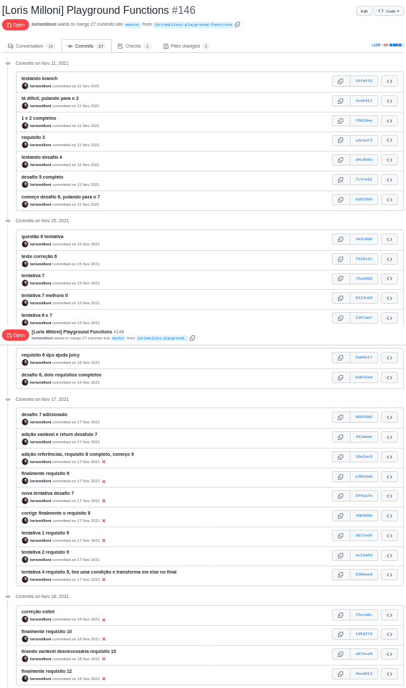
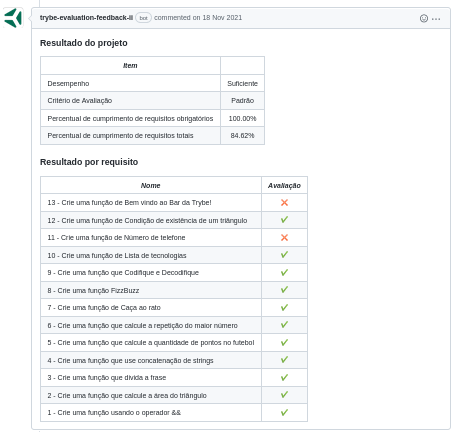

# study-project-playground-functions
Made in **17/11/2021**.

## In this assignment from Trybe we've tested our JavaScript skills.
#### Writing code using variables and primitive types, dinamic types, logical opertators, arithmetic operators and assingment operators. We also used loop and iterator, if/else, for/in, objects and functions. We learned how to organize our code, to break our problems in little baby steps, and to use programming logic to solve our problems.

#### Trybe has a private repository with files that can't be shared. So here is my commit history print:

#### Here is the Trybe Evaluator

